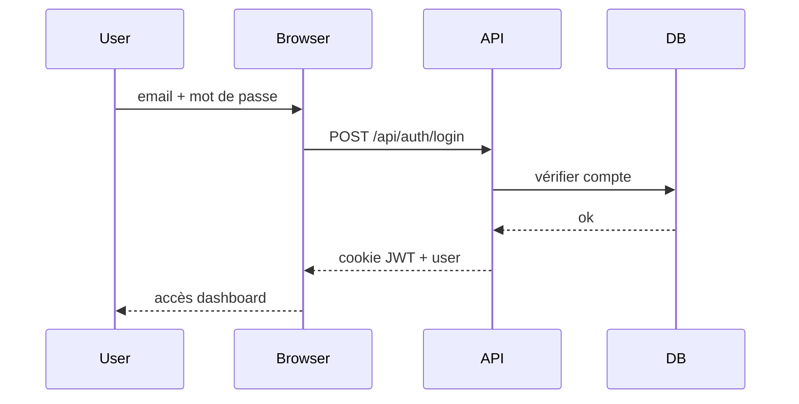
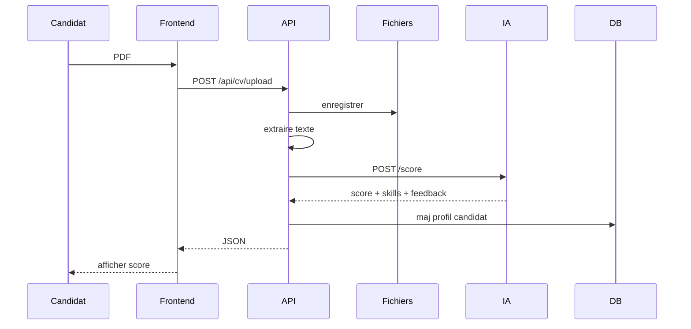
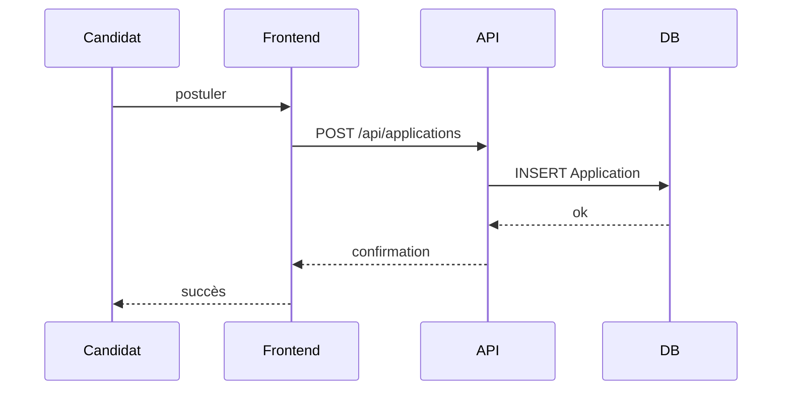
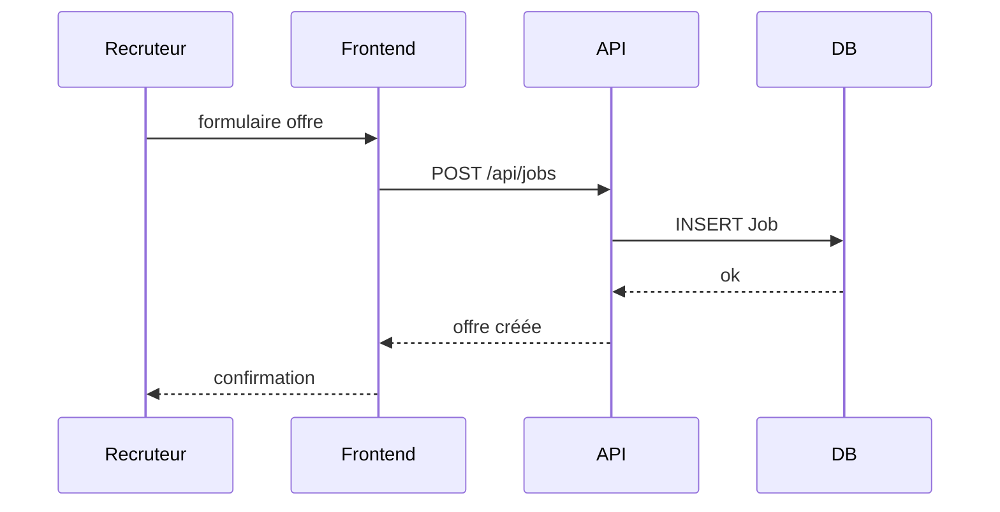
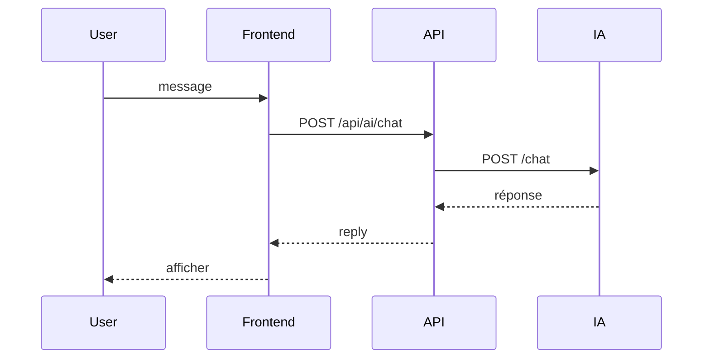
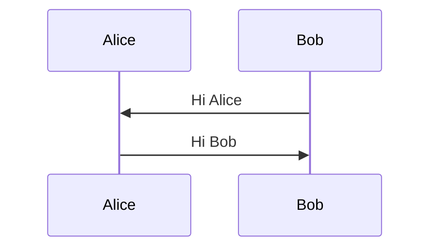

# Diagrammes de séquence (style simple)

Coller chaque bloc (de ` ```mermaid ` à ` ``` `) sur [mermaid.live](https://mermaid.live).

---

## 1. Connexion



---

## 2. Upload CV + score IA



---

## 3. Candidature



---

## 4. Offre recruteur



---

## 5. Chat IA



---

## Exemple minimal (test)


